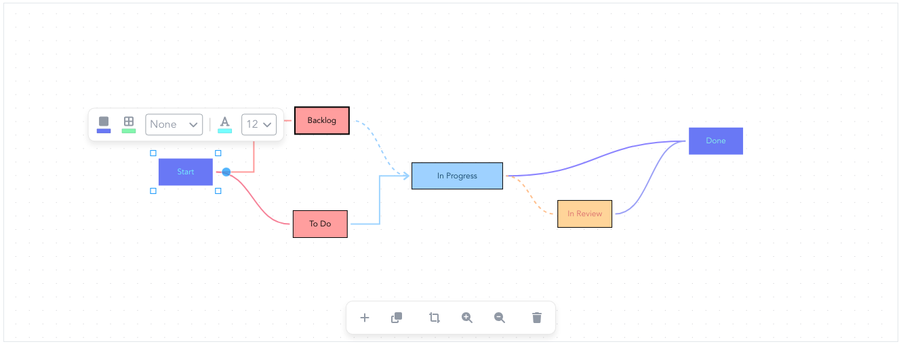

<div id="top"></div>

[![LinkedIn][linkedin-shield]][linkedin-url]

<!-- PROJECT LOGO -->
<br />
<div align="center">
  <a href="https://github.com/ahmetkoprulu/okkes">
    
  </a>

<h3 align="center">Vue2 Flow</h3>

  <p align="center">
    simple and customizable vue 2 flow chart component.
    <br />
  </p>
</div>

<!-- TABLE OF CONTENTS -->
<details>
  <summary>Table of Contents</summary>
  <ol>
    <li>
      <a href="#about-the-project">About The Project</a>
      <ul>
        <li><a href="#features">Features</a></li>
      </ul>
    </li>
    <li>
      <a href="#getting-started">Getting Started</a>
      <ul>
        <li><a href="#basics">Basics</a></li>
        <li><a href="#development">Development</a></li>
      </ul>
    </li>
	    <li>
      <a href="#contribution">Contribution</a>
      <ul>
        <li><a href="#to-do">To Do</a></li>
      </ul>
    </li>
    <li><a href="#license">License</a></li>
  </ol>
</details>

<!-- ABOUT THE PROJECT -->

## About The Project

You can build flow diagrams or develop editors to make users able to build ones with vue2 flow. The rest is your imagination.

**Demo project:** https://codesandbox.io/s/vue2-flow-demo-mjdogn

### Features

- **Simple Use:** Designed for the dummiest user
- **Easy Setup:** Charts can be created with few lines of code
- **Utils:** Built-in zooming and panning, dragging and resizing
- **Extensible:** Lots of exposed slots, events and properties

<!-- GETTING STARTED -->

## Getting Started

To install vue2 flow, use `npm i vue2-flow` or `yarn add vue2-flow` for yarn.

### Basics

Flow renders nodes and connections separately. Therefore, it expects array of nodes and connections.

The only constraint for them is that both require unique id. Even `addNode` method handles it, you can also use `generateId` method to have one.

A simple example is as follows.

```vue
<script setup>
import VFlow from "vue2-flow";

export default {
  data() {
    return {
      nodes: [
        {
          id: 1,
          x: 84,
          y: 189,
          width: 120,
          height: 50,
          name: "Start",
          type: "input",
        },
        {
          id: 2,
          x: 782,
          y: 188,
          width: 120,
          height: 50,
          name: "End",
          type: "output",
        },
      ],
      conns: [],
    };
  },
};
</script>

<template>
  <v-flow :nodes="nodes" :conns="conns" />
</template>
```

Definitely check documentation folder for the api and practicises.

### Development

Run `npm run serve` command to start dev application located at **dev/serve.vue**. However, it requires **Vue CLI** to be installed.

It mounts **editor** example located at **examples**. You can change it to whichever you want and play with them or directly import vue2 flow and start fresh one.

## Contribution

All contributions are welcome, there are lots of thing to do :)

Do not hesitate to create issues about bugs and ideas.

### To Do

- Tests\*\*\*
- Readonly mode
- Connection texts
- Shapes
- Component based nodes
- Improve connection paths
- More examples

<!-- LICENSE -->

## License

Distributed under the MIT License. See `LICENSE.txt` for more information.

<!-- MARKDOWN LINKS & IMAGES -->
<!-- https://www.markdownguide.org/basic-syntax/#reference-style-links -->

[linkedin-shield]: https://img.shields.io/badge/-LinkedIn-black.svg?style=for-the-badge&logo=linkedin&colorB=555
[linkedin-url]: https://www.linkedin.com/in/ahmetkoprulu/
